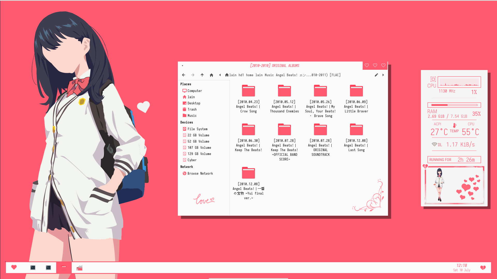

# Love Bites 💋

## Screenshot 🤳



## Installation 💻

**WARNING : Every time you copy something from my repo to your home directory, you may be replacing an exisitng config. Make sure you have backups before replacing any file.**

**I am not responsible for dysfunctional systems and/or dead neighbors.**

If there are any errors or something is missing, please let me know. I don't trust myself to get it right in one go...

### Clone the repo 💸

```sh
git clone https://github.com/flyingcakes85/LoveBites
cd LoveBites
```

Further commands will be run assuming your working directory is this git repo.

### Gtk/Xfwm Theme 💄

```sh
cd .themes
tar -xvf LoveBites.tar.gz
mkdir -p ~/.themes
cp LoveBites ~/.themes/ -r
```

Change theme to LoveBites using Xfce's appearance settings from app launcher, or run `xfce4-appearance-settings` in a terminal.

Open Xfwm Setting to change Xfwm theme to LoveBites.

### Thunar (Gtk CSS) 💞

For design at bottom right, and the typography on sidebar

```sh
mkdir -p ~/.config/gtk-3.0
touch ~/.config/gtk-3.0/gtk.css
cat .config/gtk-3.0/gtk.css >> ~/.config/gtk-3.0/gtk.css
sed -i "s/YOURUSERNAME/$USER/g" ~/.config/gtk-3.0/gtk.css
cp .config/gtk-3.0/.assets ~/.config/gtk-3.0/ -r
```

### Icons 💍

```sh
cd .icons
tar -xvf PapirusRed.tar.gz
mkdir -p ~/.icons
cp PapirusRed ~/.icons/ -r
```

Change icon theme to PapirusRed using Xfce's appearance settings from app launcher, or run `xfce4-appearance-settings` in a terminal.

### Compositor 👠

I am using picom instead of the default Xfce compositor.

```sh
mkdir -p ~/.config/picom
cp .config/picom/picom.conf ~/.config/picom/picom.conf
```

Open Window Manager Tweaks. In the last tab "Compositor", uncheck "Enable display compositing.

Add picom to Xfce session autostart. Run `xfce4-session-settings` in a terminal. In second tab "Application Autostart", click plus icon at bottom and add new entry. Set command as `picom &` and "Trigger" to "on login".

### Tint2 Panel 🚗

```sh
mkdir -p ~/.config/tint2
cp .config/tint2/* ~/.config/tint2/ -r
sed -i "s/lain/$USER/g" ~/.config/tint2/tint2rc
```

Add tint2 to Xfce session autostart. Run `xfce4-session-settings` in a terminal. In second tab "Application Autostart", click plus icon at bottom and add new entry. Set command as `tint2 &` and "Trigger" to "on login".

You can modify tint2 panel. Run `tint2conf` in a terminal and double click on the first entry.

### Conky 👛

```sh
cp .config/conky ~/.config/ -r
```

Most probably you will need to play around with the offset values in `.conkyrc` to make it display properly.

Add tint2 to Xfce session autostart. Run `xfce4-session-settings` in a terminal. In second tab "Application Autostart", click plus icon at bottom and add new entry. Set command as `conky &` and "Trigger" to "on login".

### Font

I have used Iosevka. Specifically speaking, its the [Nerd Font Patched](https://aur.archlinux.org/packages/nerd-fonts-iosevka/) variant.

## Credits 🙏

- Concept and conky : [Takami Chika](https://www.reddit.com/r/unixporn/comments/52zks6/xfwm4_takami_chika/) by [u/advanceduser](https://www.reddit.com/user/advanceduser/)
- Wallpaper : [Rikka Takarada Minimalist](https://www.deviantart.com/kiddblaster/art/Rikka-Takarada-Minimalist-785029419) by [Kiddblaster](https://www.deviantart.com/kiddblaster)
- All the City Pop and Future Funk I listened while I bunked my classes to work on this

## Contact 💌

- email : com dot protonmail at snehitsah
- reddit : [u/StunningConcentrate7](http://reddit.com/u/StunningConcentrate7)

## License ⚔️

GPL-3.0-or-later

**This license does not apply to `wallpaper.png`**
